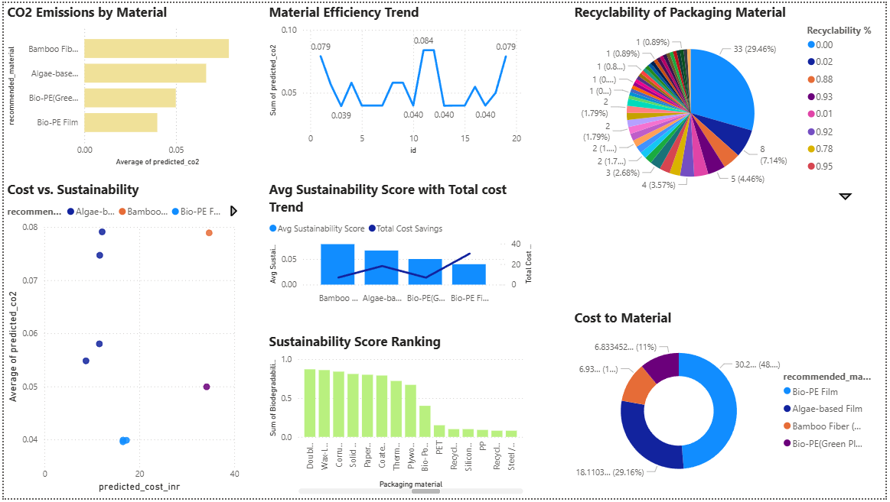

# 🌍 EcoPack AI: Sustainable Packaging Advisor

**Intelligent Material Recommendations for Sustainable Success**

## 📖 Introduction: The Problem & The Solution

**What are we doing?** We are building an AI-driven decision-making tool that recommends the best packaging material based on product specifications.

**Why are we doing it?** Modern businesses struggle to balance cost with sustainability. Standard packaging often leads to excess waste or unnecessary expenses. This tool automates the selection process to minimize carbon footprints while keeping costs low.

**How are we doing it?** By integrating a Flask web application with Random Forest and XGBoost models, and utilizing Supabase (PostgreSQL) for real-time data persistence and Power BI for stakeholder analytics.

## 🚀 Live Demo
🔗 [View Live Project on Render](https://ecoack-ai.onrender.com)

---

## 📊 System Architecture


The system consists of three main components:
* **Frontend**: A responsive Bootstrap UI for user input.
* **Backend**: Flask server hosted on Render, running RandomForest and XGBoost models.
* **Database**: Supabase PostgreSQL for real-time history tracking and Power BI integration.

---

## 🧠 Machine Learning & Logic
The core engine predicts two critical metrics for every material:
1. **Predicted Cost (INR)**: Calculated using a Random Forest Regressor.
2. **Carbon Footprint (CO2)**: Predicted using an XGBoost model.

The **Environment Score** is calculated as:
$$EnvScore = (CO2 \times 0.7) + (Cost \times 0.3)$$
*Lower scores indicate a better balance between budget and sustainability.*

---

📊 Analytics Dashboard (Power BI)
The Power BI dashboard connects via DirectQuery to the Supabase database. It tracks:
* Recommendation History: Real-time updates as users interact with the website.
* Material Trends: Visualizes which materials (e.g., Algae-based film, Recycled Cardboard) are the most versatile across different weight categories.
* Sustainability Impact: Calculates the total "Potential CO2 Savings" by comparing AI recommendations to traditional plastic packaging.


* **Real-time Tracking**: New recommendations appear instantly in the dashboard via DirectQuery.
* **Insights**: Visualize the relationship between material strength and environmental impact.


  

---

## 🛠️ Tech Stack
* **Language**: Python 3.11
* **Web Framework**: Flask
* **Database**: PostgreSQL (Supabase)
* **ML Libraries**: Scikit-Learn, XGBoost, Pandas, Joblib
* **Visualization**: Power BI
* **Deployment**: Render (Gunicorn)

---

## 📊 Dashboard
   

---

## 📥 Local Setup
1. Clone the repository:
   ```bash
   git clone [https://github.com/CodedBankai/EcoPackAI.git](https://github.com/CodedBankai/EcoPackAI.git)
